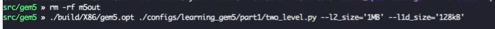
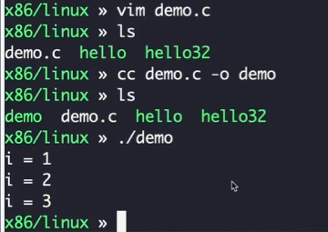
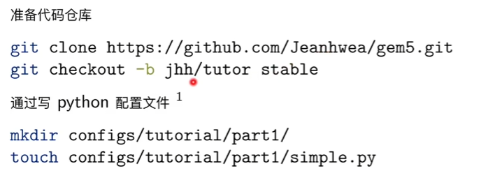
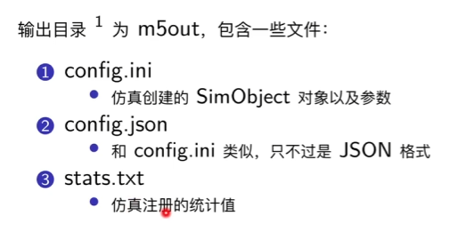
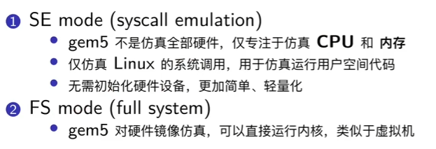
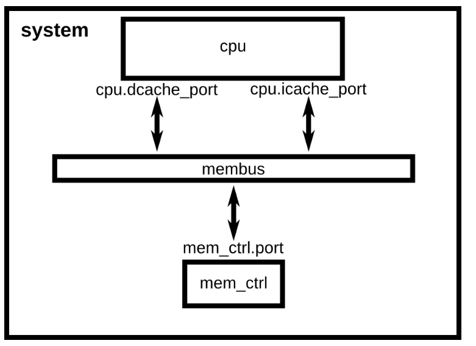
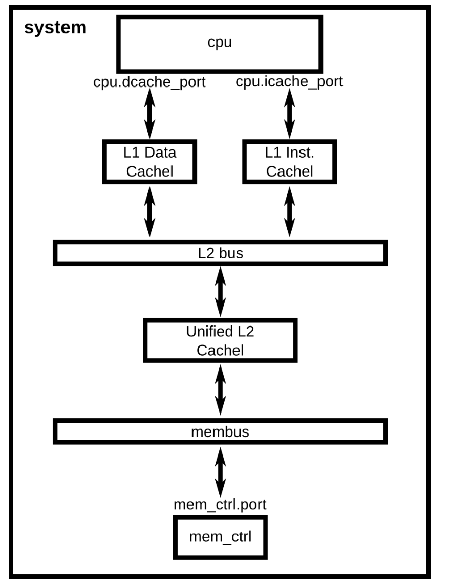
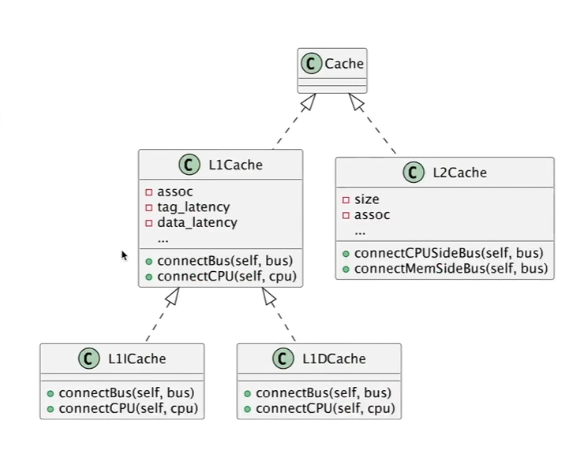
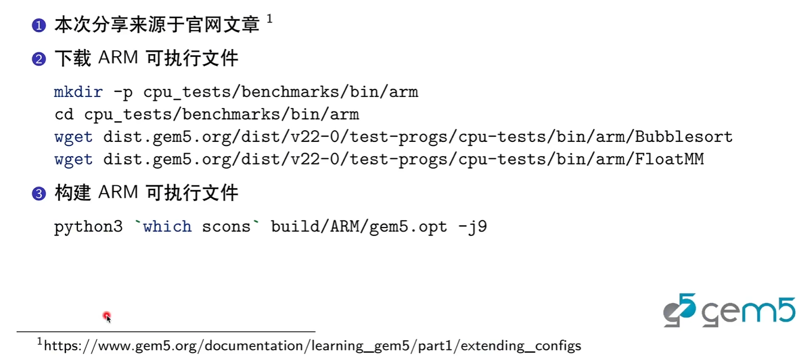

## 作业

spmm利用gem5仿真
1.gem5仿真环境
为了在 gem5 中模拟 SPMM，需要实现一个模型，其中可以包括：
处理器模型：用于执行运算，如支持 SIMD（单指令多数据）的处理器。
内存模型：用于存储稀疏矩阵和向量数据，可以使用 DRAM 或更快的缓存系统。
自定义工作负载：你需要编写 SPMM 算法的代码，确保其能够在 gem5 环境中执行。
2.准备spmm算法代码
3. 配置 gem5 模拟器
4. 运行仿真
5. 分析和调试（查看stats.txt，修改simply.py为two_level.py（需要先新建caches.py，two_level.py会调用该代码）重新仿真，看性能是否提升）

### 仿真代码，位于gem5/tests/test-progs/hello/bin/x86/linux下，名字为spmm.cpp，修改时要用 g++ -o spmm spmm.cpp 重新生成二进制文件
```C++
#include <iostream>
#include <vector>

void spmm(const std::vector<int>& rowIndex, 
          const std::vector<int>& colIndex, 
          const std::vector<int>& values, 
          const std::vector<int>& vector, 
          std::vector<int>& result, 
          int numRows) {

    for (int i = 0; i < numRows; ++i) {
        result[i] = 0;
        for (int j = rowIndex[i]; j < rowIndex[i+1]; ++j) {
            result[i] += values[j] * vector[colIndex[j]];
        }
    }
}

int main() {
    // 示例稀疏矩阵（使用CSR格式）
    std::vector<int> rowIndex = {0, 2, 4};  // 指示每行的起始位置
    std::vector<int> colIndex = {0, 1, 1, 2}; // 非零元素的列索引
    std::vector<int> values = {5, 8, 7, 3}; // 非零元素的值
    std::vector<int> vector = {1, 2, 3};    // 输入向量
    std::vector<int> result(2, 0);  // 结果向量

    spmm(rowIndex, colIndex, values, vector, result, 2);
    
    // 输出结果
    for (int val : result) {
        std::cout << val << " ";
    }
    return 0;
}

```
### https://www.bilibili.com/video/BV1Jt421F7St?spm_id_from=333.788.player.switch&vd_source=a6e78d8674ee725907a02eab07308f26
### https://www.gem5.org/documentation/learning_gem5/part1/gem5_stats/
* 查看当前运行的容器 docker ps
* 进入容器并获得root权限 docker exec -it --user root riscv64 sh
* docker exec -it sleepy_jones bash
* 进入gem5文件夹，执行的文件存放在 gem5/tests/test-progs/hello/bin/x86/linux下，在linux下新建一个demo.c文件，cc demo.c -o demo指令生成二进制可执行文件，再重新运行即可
* 运行指令 build/X86/gem5.opt configs/tutorial/part1/simple.py
* 复制到服务器上，docker cp sleepy_jones:gem5/m5out /home/ismc19/m5out
* 
* 
* 
* 
* gem5对象通过C++实现，pyhton起配置作用
* `which scons` build/X86/gem5.opt -j4
### 利用gem5基础搭建一个x86系统，位于gem5/configs/tutorial/part1/下
* 创建系统，设置时钟，电压域
* x86，membus，中断控制器，DDR3内存控制器

* 仿真模式
*  


### 简单的CPU配置

新建simply.py放下面的代码
```python
import m5
from m5.objects import *

#
system = System()
#
system.clk_domain = SrcClockDomain()
system.clk_domain.clock = '1GHz'
system.clk_domain.voltage_domain = VoltageDomain()

system.mem_mode = 'timing'
system.mem_ranges = [AddrRange('512MB')] 

#x86
system.cpu = X86TimingSimpleCPU()
#membus
system.membus = SystemXBar()
system.cpu.icache_port = system.membus.cpu_side_ports
system.cpu.dcache_port = system.membus.cpu_side_ports
#system.cpu.icache_port = system.l1_cache.cpu_side
#
#system.cpu.icache_port = system.membus.cpu_side_ports
#interrupt
system.cpu.createInterruptController()
system.cpu.interrupts[0].pio = system.membus.mem_side_ports
system.cpu.interrupts[0].int_requestor = system.membus.cpu_side_ports
system.cpu.interrupts[0].int_responder = system.membus.mem_side_ports

# connect system to the membus
system.system_port = system.membus.cpu_side_ports
#DDR3
system.mem_ctrl = MemCtrl()
system.mem_ctrl.dram = DDR3_1600_8x8()
system.mem_ctrl.dram.range = system.mem_ranges[0]
system.mem_ctrl.port = system.membus.mem_side_ports

#  exe_file
binary = 'tests/test-progs/hello/bin/x86/linux/hello'
# for gem5 V21 and beyond
system.workload = SEWorkload.init_compatible(binary)
#
process = Process()
process.cmd = [binary]
system.cpu.workload = process
system.cpu.createThreads()

# object SE mode
root = Root(full_system = False, system = system)
m5.instantiate()

print("Beginning simulation!")
exit_event = m5.simulate()
print('Exiting @ tick {} because {}'
      .format(m5.curTick(), exit_event.getCause()))

# run gem5
#在gem5文件夹下，输入对应文件夹的.opt，和.py
# build/X86/gem5.opt configs/tutorial/part1/simple.py

```

### 加入cache



新建caches.py放下面的代码,看官网链接https://github.com/gem5/gem5/blob/stable/configs/learning_gem5/part1/caches.py
```python
from m5.objects import Cache

#viedo7.47 
# compare L2, near cpu, latency small
class L1Cache(Cache):
    assoc = 2
    tag_latency = 2
    data_latency = 2
    response_latency = 2
    mshrs = 4
    tgts_per_mshr = 20
#instruction
class L1ICache(L1Cache):
    size = '16kB'
#data
class L1DCache(L1Cache):
    size = '64kB'
class L2Cache(Cache):
    size = '256kB'
    assoc = 8
    tag_latency = 20
    data_latency = 20
    response_latency = 20
    mshrs = 20
    tgts_per_mshr = 12
#
def connectCPU(self, cpu):
    # need to define this in a base class!
    raise NotImplementedError

def connectBus(self, bus):
    self.mem_side = bus.cpu_side_ports

#L1DCache and L2DCache
class L1ICache(L1Cache):
    size = '16kB'

    def connectCPU(self, cpu):
        self.cpu_side = cpu.icache_port

class L1DCache(L1Cache):
    size = '64kB'

    def connectCPU(self, cpu):
        self.cpu_side = cpu.dcache_port

#L2Cache connect
def connectCPUSideBus(self, bus):
    self.cpu_side = bus.mem_side_ports

def connectMemSideBus(self, bus):
    self.mem_side = bus.cpu_side_ports
```
新建two_level.py放下面的代码
```python

# import the m5 (gem5) library created when gem5 is built
import m5

# import all of the SimObjects
from m5.objects import *


# Add the common scripts to our path
# m5.util.addToPath("../../")
m5.util.addToPath("/gem5/configs")
# import the caches which we made
from caches import *

# import the SimpleOpts module
from common import SimpleOpts

# Default to running 'hello', use the compiled ISA to find the binary
# grab the specific path to the binary
thispath = os.path.dirname(os.path.realpath(__file__))
default_binary = os.path.join(
    thispath,
    #"../../../",
    "/gem5/",
    "tests/test-progs/hello/bin/x86/linux/hello",
)

# Binary to execute
SimpleOpts.add_option("binary", nargs="?", default=default_binary)

# Finalize the arguments and grab the args so we can pass it on to our objects
args = SimpleOpts.parse_args()

# create the system we are going to simulate
system = System()

# Set the clock frequency of the system (and all of its children)
system.clk_domain = SrcClockDomain()
system.clk_domain.clock = "1GHz"
system.clk_domain.voltage_domain = VoltageDomain()

# Set up the system
system.mem_mode = "timing"  # Use timing accesses
system.mem_ranges = [AddrRange("512MiB")]  # Create an address range

# Create a simple CPU
system.cpu = X86TimingSimpleCPU()

# Create an L1 instruction and data cache
system.cpu.icache = L1ICache(args)
system.cpu.dcache = L1DCache(args)

# Connect the instruction and data caches to the CPU
system.cpu.icache.connectCPU(system.cpu)
system.cpu.dcache.connectCPU(system.cpu)

# Create a memory bus, a coherent crossbar, in this case
system.l2bus = L2XBar()

# Hook the CPU ports up to the l2bus
system.cpu.icache.connectBus(system.l2bus)
system.cpu.dcache.connectBus(system.l2bus)

# Create an L2 cache and connect it to the l2bus
system.l2cache = L2Cache(args)
system.l2cache.connectCPUSideBus(system.l2bus)

# Create a memory bus
system.membus = SystemXBar()

# Connect the L2 cache to the membus
system.l2cache.connectMemSideBus(system.membus)

# create the interrupt controller for the CPU
system.cpu.createInterruptController()
system.cpu.interrupts[0].pio = system.membus.mem_side_ports
system.cpu.interrupts[0].int_requestor = system.membus.cpu_side_ports
system.cpu.interrupts[0].int_responder = system.membus.mem_side_ports

# Connect the system up to the membus
system.system_port = system.membus.cpu_side_ports

# Create a DDR3 memory controller
system.mem_ctrl = MemCtrl()
system.mem_ctrl.dram = DDR3_1600_8x8()
system.mem_ctrl.dram.range = system.mem_ranges[0]
system.mem_ctrl.port = system.membus.mem_side_ports

system.workload = SEWorkload.init_compatible(args.binary)

# Create a process for a simple "Hello World" application
process = Process()
# Set the command
# cmd is a list which begins with the executable (like argv)
process.cmd = [args.binary]
# Set the cpu to use the process as its workload and create thread contexts
system.cpu.workload = process
system.cpu.createThreads()

# set up the root SimObject and start the simulation
root = Root(full_system=False, system=system)
# instantiate all of the objects we've created above
m5.instantiate()

print(f"Beginning simulation!")
exit_event = m5.simulate()
print(f"Exiting @ tick {m5.curTick()} because {exit_event.getCause()}")

#run
#./build/X86/gem5.opt ./configs/tutorial/part1/two_level.py
```

### 使用默认配置，注意有些文件夹已移动，放在deprecated/中
* 无参
build/X86/gem5.opt configs/deprecated/example/se.py --cmd=tests/test-progs/hello/bin/x86/linux/hello
### 加入ARM支持


