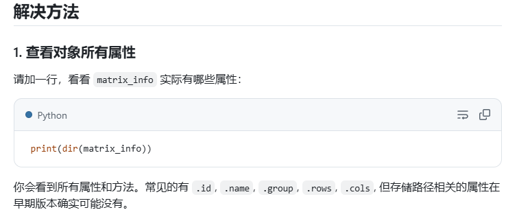

## 如何在gem5仿真中使用SuiteSparse数据集
SuiteSparse矩阵集合是稀疏矩阵计算领域最广泛使用的基准测试集之一。下面详细介绍如何将SuiteSparse中的数据集集成到gem5仿真环境中。
### 文件目录结构
```python
# 文件目录结构
spmm_gem5/
├── datasets/                  # 存储矩阵数据集
│   ├── download.py            # 下载SuiteSparse矩阵的脚本
│   ├── convert.py            # 格式转换脚本
│   └── matrices/              # 存放.mtx和转换后的二进制文件
├── src/                       # C++源代码
│   ├── sparse_loader.h        # 矩阵加载头文件
│   ├── sparse_loader.cpp      # 矩阵加载实现
│   ├── spmm_test.cpp         # 测试主程序
│   └── Makefile              # 编译脚本
├── gem5/                      # gem5相关文件
│   ├── run_spmm.py           # gem5运行脚本1
│   ├── two_level_spmm.py        # gem5运行脚本2
│   └── ...                    # 其它基本配置文件
└── ...                        # 其它基本配置文件
```
### 获取SuiteSparse矩阵数据
#### 下载SuiteSparse矩阵集
```python
#或者使用Python API下载特定矩阵
pip install ssgetpy
```
### Python脚本位置与功能
#### 数据下载脚本(datasets/download.py)

```python
# datasets/download.py
# -*- coding: <encoding-name> -*-
import ssgetpy
import tarfile
import os
from scipy.io import mmread, mmwrite

matrix_info = ssgetpy.fetch('HB/bcspwr01')[0]
matrix_info.download()

# 获取 .tar.gz 路径（tuple第一个元素）
tar_path = matrix_info.localpath()[0]
print("tar_path:", tar_path)

# 解压到临时目录
extract_dir = "/tmp/ssgetpy_extract"
os.makedirs(extract_dir, exist_ok=True)
with tarfile.open(tar_path, "r:gz") as tar:
    tar.extractall(path=extract_dir)

# 查找 .mtx 文件路径
for root, dirs, files in os.walk(extract_dir):
    for file in files:
        if file.endswith(".mtx"):
            mtx_path = os.path.join(root, file)
            print("mtx_path:", mtx_path)
            break

A = mmread(mtx_path)
mmwrite('/matrices/bcspwr01.mtx', A)     #保存到当前文件位置的下一个文件夹matrices中
print("Matrix saved as bcspwr01.mtx")

```

#### 格式转换脚本 (datasets/convert.py)  在目录下执行命令python convert.py生成指定二进制矩阵文件数据

```python
# datasets/convert.py
from scipy.io import mmread
from scipy.sparse import csr_matrix
import numpy as np
import os

def mtx_to_binary(mtx_path, binary_path):
    """ 将.mtx文件转换为自定义二进制格式 """
    sparse_matrix = mmread(mtx_path)
    csr = csr_matrix(sparse_matrix)
    
    with open(binary_path, 'wb') as f:
        # 头部信息: 行数, 列数, 非零元数 (各4字节)
        np.array([csr.shape[0], csr.shape[1], csr.nnz], 
                dtype=np.int32).tofile(f)
        # 数据部分
        csr.indptr.astype(np.int32).tofile(f)  # 行指针
        csr.indices.astype(np.int32).tofile(f) # 列索引
        csr.data.astype(np.float32).tofile(f)   # 非零值

def convert_all(source_dir="matrices", target_dir="matrices"):
    """ 转换目录下所有.mtx文件 """
    for filename in os.listdir(source_dir):
        if filename.endswith(".mtx"):
            mtx_path = os.path.join(source_dir, filename)
            binary_path = os.path.join(target_dir, 
                                     filename.replace(".mtx", ".bin"))
            mtx_to_binary(mtx_path, binary_path)
            print(f"转换完成: {filename} -> {binary_path}")

if __name__ == "__main__":
    convert_all()
```

### C++文件实现与调用关系
#### 矩阵加载头文件 (src/sparse_loader.h)
```cpp
// src/sparse_loader.h
#ifndef SPARSE_LOADER_H
#define SPARSE_LOADER_H

struct CSRMatrix {
    int rows;       // 矩阵行数
    int cols;       // 矩阵列数
    int nnz;        // 非零元素数量
    int* row_ptr;   // 行指针数组 (长度为rows+1)
    int* col_idx;   // 列索引数组 (长度为nnz)
    float* values;  // 非零值数组 (长度为nnz)
    
    ~CSRMatrix() {
        delete[] row_ptr;
        delete[] col_idx;
        delete[] values;
    }
};

// 从二进制文件加载CSR矩阵
CSRMatrix load_csr_binary(const char* filename);

// 稀疏矩阵乘法 (SpMM)
void spmm_csr(const CSRMatrix& A, const float* B, float* C, int n);

#endif
```

#### 矩阵加载实现 (src/sparse_loader.cpp)

```cpp
// src/sparse_loader.cpp
#include "sparse_loader.h"
#include <fstream>
#include <iostream>

CSRMatrix load_csr_binary(const char* filename) {
    std::ifstream in(filename, std::ios::binary);
    if (!in) {
        std::cerr << "Error: Cannot open file " << filename << std::endl;
        exit(1);
    }
    
    CSRMatrix mat;
    
    // 读取矩阵维度信息
    in.read(reinterpret_cast<char*>(&mat.rows), sizeof(int));
    in.read(reinterpret_cast<char*>(&mat.cols), sizeof(int));
    in.read(reinterpret_cast<char*>(&mat.nnz), sizeof(int));
    
    // 分配内存
    mat.row_ptr = new int[mat.rows + 1];
    mat.col_idx = new int[mat.nnz];
    mat.values = new float[mat.nnz];
    
    // 读取数据
    in.read(reinterpret_cast<char*>(mat.row_ptr), sizeof(int) * (mat.rows + 1));
    in.read(reinterpret_cast<char*>(mat.col_idx), sizeof(int) * mat.nnz);
    in.read(reinterpret_cast<char*>(mat.values), sizeof(float) * mat.nnz);
    
    if (in.fail()) {
        std::cerr << "Error: Failed to read matrix data" << std::endl;
        exit(1);
    }
    
    return mat;
}

void spmm_csr(const CSRMatrix& A, const float* B, float* C, int n) {
    // 初始化输出矩阵
    std::fill(C, C + A.rows * n, 0.0f);
    
    // 执行SpMM
    for (int i = 0; i < A.rows; ++i) {
        for (int j = A.row_ptr[i]; j < A.row_ptr[i+1]; ++j) {
            int col = A.col_idx[j];
            float val = A.values[j];
            for (int k = 0; k < n; ++k) {
                C[i * n + k] += val * B[col * n + k];
            }
        }
    }
}
```


#### 测试主程序 (src/spmm_test.cpp)
```cpp
// src/spmm_test.cpp
#include "sparse_loader.h"
#include <iostream>
#include <chrono>
#include <cstring>

int main(int argc, char** argv) {
    if (argc < 2) {
        std::cerr << "Usage: " << argv[0] << " <matrix.bin>" << std::endl;
        return 1;
    }
    
    // 1. 加载稀疏矩阵
    CSRMatrix A = load_csr_binary(argv[1]);
    std::cout << "Loaded matrix: " << A.rows << " x " << A.cols 
              << " with " << A.nnz << " non-zeros" << std::endl;
    
    // 2. 创建随机稠密矩阵B (A.cols x 16)
    const int n = 16;  // B的列数
    float* B = new float[A.cols * n];
    float* C = new float[A.rows * n];
    
    for (int i = 0; i < A.cols * n; ++i) {
        B[i] = static_cast<float>(rand()) / RAND_MAX;
    }
    
    // 3. 执行SpMM并计时
    auto start = std::chrono::high_resolution_clock::now();
    
    spmm_csr(A, B, C, n);
    
    auto end = std::chrono::high_resolution_clock::now();
    auto duration = std::chrono::duration_cast<std::chrono::milliseconds>(end - start);
    
    std::cout << "SpMM completed in " << duration.count() << " ms" << std::endl;
    
    // 4. 清理内存
    delete[] B;
    delete[] C;
    
    return 0;
}
```
##### 测试 先用命令g++ -O2 -std=c++11 spmm_test.cpp sparse_loader.cpp -o spmm_test ，再用命令./spmm_test（./spmm_test ../datasets/matrices/bcspwr01.bin）
```cpp
#include <cassert>
#include <iostream>
#include <cmath>
#include "sparse_loader.h" // 你实际的CSRMatrix和spmm_csr声明头文件名

void test_spmm() {
    // 构造一个简单的 3x3 CSR 矩阵 (单位矩阵)
    CSRMatrix A;
    A.rows = 3; A.cols = 3; A.nnz = 3;
    A.row_ptr = new int[4]{0, 1, 2, 3};
    A.col_idx = new int[3]{0, 1, 2};
    A.values = new float[3]{1.0f, 1.0f, 1.0f};

    // 构造一个 3x2 稠密矩阵 B
    float B[] = {1.0f, 2.0f, 
                 3.0f, 4.0f, 
                 5.0f, 6.0f};

    // 预期结果 C = A * B = B（因为 A 是单位矩阵）
    float expected_C[] = {1.0f, 2.0f, 
                          3.0f, 4.0f, 
                          5.0f, 6.0f};

    // 调用 SpMM
    float C[6];
    spmm_csr(A, B, C, 2);

    // 验证结果
    for (int i = 0; i < 6; ++i) {
        assert(std::fabs(C[i] - expected_C[i]) < 1e-6);
    }

    std::cout << "测试通过！" << std::endl;

    // 释放分配的内存
    delete[] A.row_ptr;
    delete[] A.col_idx;
    delete[] A.values;
}

int main() {
    test_spmm();  // 运行单元测试
    return 0;
}
```

#### 编译脚本 (src/Makefile)在src目录下直接输入make编译下面的代码
```
# src/Makefile
CXX := g++
CXXFLAGS := -O2 -Wall -std=c++11
LDFLAGS := 
TARGET := spmm_test
SRCS := sparse_loader.cpp spmm_test.cpp
OBJS := $(SRCS:.cpp=.o)

all: $(TARGET)

$(TARGET): $(OBJS)
	$(CXX) $(CXXFLAGS) -o $@ $^ $(LDFLAGS)

%.o: %.cpp
	$(CXX) $(CXXFLAGS) -c $< -o $@

clean:
	rm -f $(OBJS) $(TARGET)

.PHONY: all clean
```
### gem5集成与调用
#### gem5运行脚本 (gem5/run_spmm.py) ，在gem5目录下输入build/X86/gem5.opt run_spmm.py --matrix=../datasets/matrices/bcspwr01.bin进行编译
```python
# gem5/run_spmm.py
import m5
from m5.objects import *
import argparse
import os

def build_spmm_system(matrix_file=None):
    """构建支持稀疏矩阵乘法的仿真系统"""
    # 创建系统
    system = System()
    system.clk_domain = SrcClockDomain()
    system.clk_domain.clock = '1GHz'
    system.clk_domain.voltage_domain = VoltageDomain()
    system.mem_mode = 'timing'
    system.mem_ranges = [AddrRange('512MB')] 

    # CPU配置
    system.cpu = X86TimingSimpleCPU()
    
    # 内存总线
    system.membus = SystemXBar()
    system.cpu.icache_port = system.membus.cpu_side_ports
    system.cpu.dcache_port = system.membus.cpu_side_ports
    
    # 中断控制器
    system.cpu.createInterruptController()
    system.cpu.interrupts[0].pio = system.membus.mem_side_ports
    system.cpu.interrupts[0].int_requestor = system.membus.cpu_side_ports
    system.cpu.interrupts[0].int_responder = system.membus.mem_side_ports

    # 系统端口连接
    system.system_port = system.membus.cpu_side_ports
    
    # 内存控制器
    system.mem_ctrl = MemCtrl()
    system.mem_ctrl.dram = DDR3_1600_8x8()
    system.mem_ctrl.dram.range = system.mem_ranges[0]
    system.mem_ctrl.port = system.membus.mem_side_ports

    # 设置工作负载
    if matrix_file:
        # 稀疏矩阵测试模式
        binary = os.path.abspath('../src/spmm_test')
        system.workload = SEWorkload.init_compatible(binary)
        process = Process()
        process.cmd = [binary, os.path.abspath(matrix_file)]
    else:
        # 默认hello测试模式
        binary = os.path.abspath('tests/test-progs/hello/bin/x86/linux/hello')
        system.workload = SEWorkload.init_compatible(binary)
        process = Process()
        process.cmd = [binary]
    
    system.cpu.workload = process
    system.cpu.createThreads()
    
    return system

# === 参数解析部分 ===
parser = argparse.ArgumentParser(description='gem5仿真配置')
parser.add_argument('--matrix', type=str, help='稀疏矩阵文件路径(如../datasets/matrices/bcspwr01.bin)')
args = parser.parse_args()
    
# 构建系统
system = build_spmm_system(args.matrix)

# 启动仿真
root = Root(full_system=False, system=system)
m5.instantiate()

print("开始仿真...")
exit_event = m5.simulate()

print('仿真结束 @ tick {}，原因: {}'.format(m5.curTick(), exit_event.getCause()))

# 打印输出
if os.path.exists('m5out/simout'):
    print("\n=== 程序输出 ===")
    with open('m5out/simout', 'r') as f:
        print(f.read())

```
#### 加入cachesd的gem5脚本 (two_level_spmm.py)
caches.py
```python
from m5.objects import Cache

class L1Cache(Cache):
    def __init__(self, options=None):
        super().__init__()
        self.assoc = options.l1i_assoc if hasattr(options, "l1i_assoc") else 2
        self.tag_latency = 2
        self.data_latency = 2
        self.response_latency = 2
        self.mshrs = 4
        self.tgts_per_mshr = 20

class L1ICache(L1Cache):
    def __init__(self, options=None):
        super().__init__(options)
        self.size = options.l1i_size if hasattr(options, "l1i_size") else '16kB'

    def connectCPU(self, cpu):
        self.cpu_side = cpu.icache_port

class L1DCache(L1Cache):
    def __init__(self, options=None):
        super().__init__(options)
        self.size = options.l1d_size if hasattr(options, "l1d_size") else '64kB'

    def connectCPU(self, cpu):
        self.cpu_side = cpu.dcache_port

class L2Cache(Cache):
    def __init__(self, options=None):
        super().__init__()
        self.size = options.l2_size if hasattr(options, "l2_size") else '256kB'
        self.assoc = options.l2_assoc if hasattr(options, "l2_assoc") else 8
        self.tag_latency = 20
        self.data_latency = 20
        self.response_latency = 20
        self.mshrs = 20
        self.tgts_per_mshr = 12

    def connectCPUSideBus(self, bus):
        self.cpu_side = bus.mem_side_ports

    def connectMemSideBus(self, bus):
        self.mem_side = bus.cpu_side_ports
```


```py
import argparse
import m5
import os
from m5.objects import *
from caches import *

# === 参数解析部分 ===
parser = argparse.ArgumentParser(description='gem5仿真配置')
parser.add_argument('--matrix', type=str, help='稀疏矩阵文件路径(如../datasets/matrices/bcspwr01.bin)')
parser.add_argument('--binary', type=str, help='要执行的二进制文件路径', default='tests/test-progs/hello/bin/x86/linux/hello')


parser.add_argument("--l1i_size", type=str, default="16kB")
parser.add_argument("--l1d_size", type=str, default="64kB")
parser.add_argument("--l2_size", type=str, default="256kB")
parser.add_argument("--l1i_assoc", type=int, default=2)
parser.add_argument("--l1d_assoc", type=int, default=2)
parser.add_argument("--l2_assoc", type=int, default=8)
args = parser.parse_args()
def build_spmm_system(matrix_file=None, binary=None):
    if not matrix_file:
        binary = os.path.abspath('tests/test-progs/hello/bin/x86/linux/hello')
    else:
        binary = os.path.abspath('../src/spmm_test')

    # Create the system we are going to simulate
    system = System()

    # Set the clock frequency of the system (and all of its children)
    system.clk_domain = SrcClockDomain()
    system.clk_domain.clock = "1GHz"
    system.clk_domain.voltage_domain = VoltageDomain()

    # Set up the system
    system.mem_mode = "timing"  # Use timing accesses
    system.mem_ranges = [AddrRange("512MiB")]  # Create an address range

    # Create a simple CPU
    system.cpu = X86TimingSimpleCPU()

    # Create L1 instruction and data caches
    system.cpu.icache = L1ICache()
    system.cpu.dcache = L1DCache()

    # Connect the instruction and data caches to the CPU
    system.cpu.icache.connectCPU(system.cpu)
    system.cpu.dcache.connectCPU(system.cpu)

    # Create a memory bus, a coherent crossbar
    system.l2bus = L2XBar()

    # Hook the CPU ports up to the l2bus
    system.cpu.icache.connectBus(system.l2bus)
    system.cpu.dcache.connectBus(system.l2bus)

    # Create an L2 cache and connect it to the l2bus
    system.l2cache = L2Cache()
    system.l2cache.connectCPUSideBus(system.l2bus)

    # Create a memory bus
    system.membus = SystemXBar()

    # Connect the L2 cache to the membus
    system.l2cache.connectMemSideBus(system.membus)

    # Create the interrupt controller for the CPU
    system.cpu.createInterruptController()
    system.cpu.interrupts[0].pio = system.membus.mem_side_ports
    system.cpu.interrupts[0].int_requestor = system.membus.cpu_side_ports
    system.cpu.interrupts[0].int_responder = system.membus.mem_side_ports

    # Connect the system up to the membus
    system.system_port = system.membus.cpu_side_ports

    # Create a DDR3 memory controller
    system.mem_ctrl = MemCtrl()
    system.mem_ctrl.dram = DDR3_1600_8x8()
    system.mem_ctrl.dram.range = system.mem_ranges[0]
    system.mem_ctrl.port = system.membus.mem_side_ports

    # Workload setup (if matrix_file is provided, use sparse matrix binary)
    system.workload = SEWorkload.init_compatible(binary)

    # Create a process for the workload (SPMM matrix application)
    process = Process()

    if matrix_file:
        # If matrix file is given, add it to the process command
        process.cmd = [binary, os.path.abspath(matrix_file)]  # Path to the matrix file
    else:
        # If no matrix file, run the default hello test binary
        process.cmd = [binary]

    # Set the cpu to use the process as its workload and create thread contexts
    system.cpu.workload = process
    system.cpu.createThreads()

    # Set up the root SimObject and start the simulation
    root = Root(full_system=False, system=system)
    m5.instantiate()

    print(f"Beginning simulation with binary: {binary}")
    if matrix_file:
        print(f"Using matrix file: {matrix_file}")
    exit_event = m5.simulate()
    print(f"Exiting @ tick {m5.curTick()} because {exit_event.getCause()}")

    return system

# 构建系统并启动仿真
system = build_spmm_system(args.matrix, args.binary)

# print("开始仿真...")
# exit_event = m5.simulate()

```


